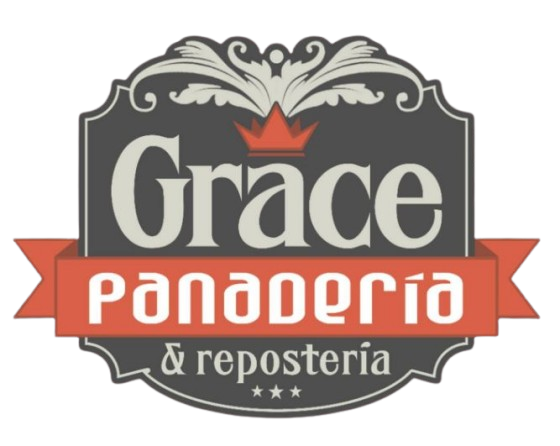
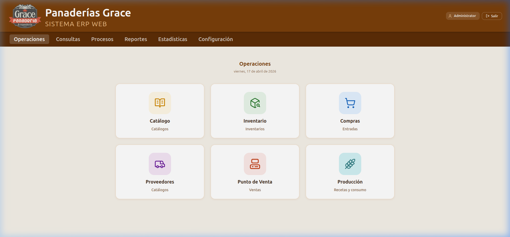
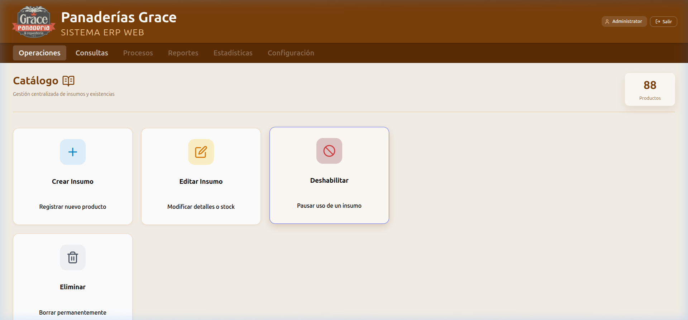
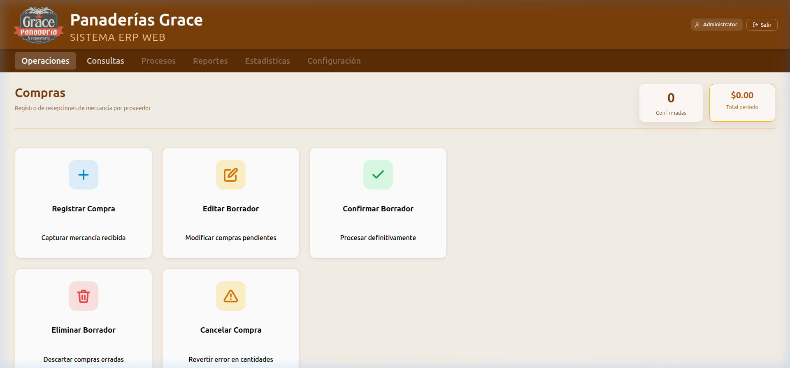
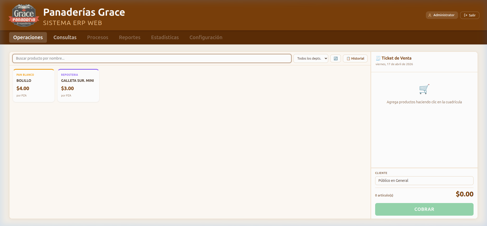

<p align="center">
  
</p>

<h1 align="center">Grace ERP Web</h1>

<p align="center">
  Sistema de gestión integral para panaderías y reposterías, construido sobre ERPNext con un frontend moderno en React + Vite.
</p>

<p align="center">
  
  
  
  
  
</p>

---

## ¿Qué es esto?

Grace ERP Web es el frontend de un sistema ERP (Planificación de Recursos Empresariales) diseñado específicamente para el giro de **panadería y repostería**. Integra directamente con el backend de **Frappe / ERPNext** mediante su API REST, ofreciendo una interfaz limpia y funcional optimizada para las operaciones diarias del negocio.

> Desarrollado como proyecto de residencia profesional en la empresa **Panaderías Grace**.

---

## Capturas de pantalla

### Panel Principal


### Catálogo de Insumos


### Compras


### Punto de Venta (POS)


---

## Módulos

| Módulo | Descripción |
|---|---|
| 🗂️ **Catálogo** | Alta, edición y gestión de insumos (materias primas, productos terminados, insumos generales) |
| 📦 **Inventario** | Consulta de existencias en almacén con filtros por categoría y tipo |
| 🛒 **Compras** | Registro de recepciones de mercancía, borradores, confirmación y cancelación |
| 🚚 **Proveedores** | Directorio de proveedores activos e inactivos con búsqueda y paginación |
| 🧾 **Punto de Venta** | POS táctil con ticket de venta, historial y corte de caja |
| 🌾 **Producción** | Registro de producción por receta con consumo automático de ingredientes |

---

## Stack tecnológico

- **Frontend:** React 18, React Router 7, Vite 5
- **Backend:** Frappe Framework / ERPNext (API REST)
- **Comunicación:** `frappe-react-sdk` + cliente HTTP propio (`FrappeBase`)
- **Estilo:** CSS vanilla con diseño propio (sin frameworks CSS)
- **Arquitectura:** Capa de servicios por dominio (`frappeInventory`, `frappePurchase`, `frappePOS`…), hooks reutilizables (`useConfirmModal`, `useDebounce`), rutas protegidas

---

## Estructura del proyecto

```
src/
├── components/     # Componentes reutilizables (modales, formularios, layout)
├── config/         # Constantes globales
├── hooks/          # Custom hooks (useConfirmModal, useDebounce)
├── pages/          # Vistas principales (Panel, Catálogo, Compras, POS…)
├── services/       # Capa de acceso a la API de Frappe por dominio
│   ├── FrappeBase.js
│   ├── frappeInventory.js
│   ├── frappePurchase.js
│   ├── frappePOS.js
│   └── ...
└── styles/         # Hojas de estilo por módulo
```

---

## Instalación y desarrollo

### Prerequisitos
- Node.js ≥ 18
- Una instancia de Frappe / ERPNext corriendo localmente o en red

```bash
# 1. Clonar el repositorio
git clone https://github.com/tu-usuario/bake-data-frontend.git
cd bake-data-frontend

# 2. Instalar dependencias
npm install

# 3. Configurar variables de entorno
cp .env.backup .env
# Editar .env con la URL de tu instancia Frappe

# 4. Iniciar servidor de desarrollo
npm run dev
```

---

## Variables de entorno

```env
VITE_FRAPPE_URL=http://tu-servidor-frappe:8000
```

---

## Autor

**Diemar** — Proyecto de residencia profesional  
Ingeniería en Sistemas Computacionales

---

<p align="center">
  Hecho con ☕ y mucho pan 🍞
</p>
