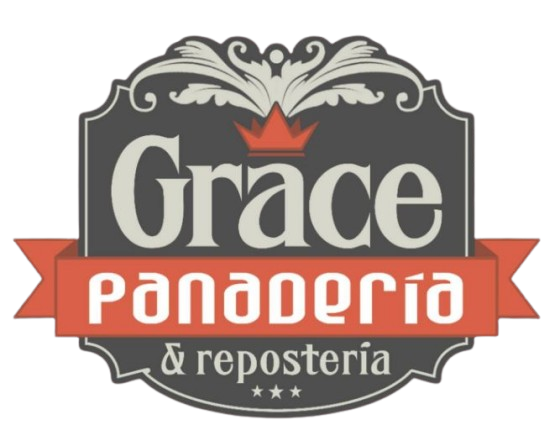
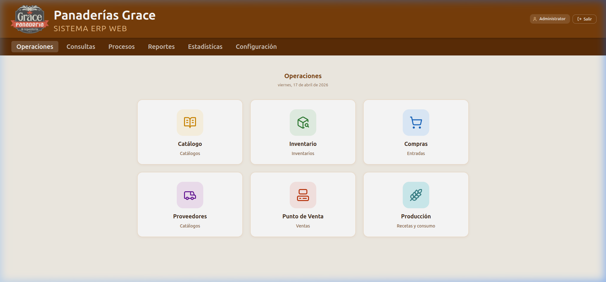
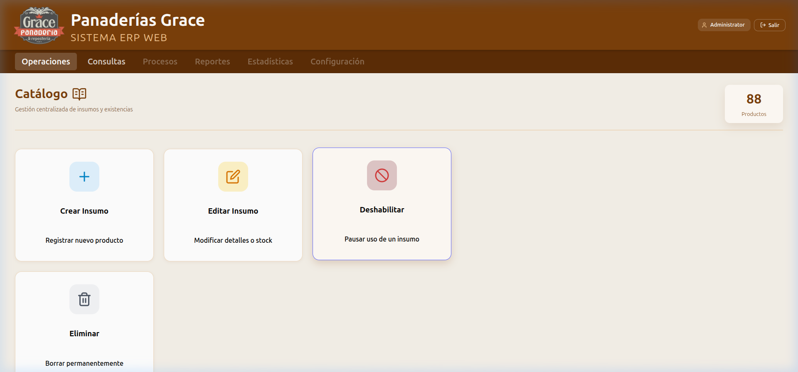
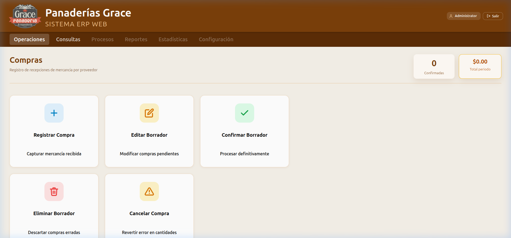
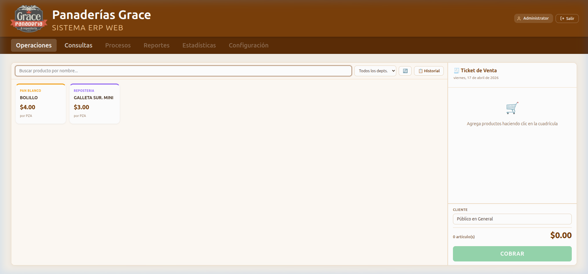

<p align="center">
  
</p>

<h1 align="center">Grace ERP Web</h1>

<p align="center">
  Sistema de gestión integral para panaderías, construido sobre ERPNext con un frontend en React + Vite.
</p>

<p align="center">
  
  
  
  
  
  
</p>

---

## ¿Qué es esto?

El frontend de un ERP hecho a la medida de **Panaderías Grace**: matriz, 4 sucursales y camionetas de reparto. Habla con **Frappe / ERPNext** por su API REST.

> **Esta app ES el producto. ERPNext es el motor.** Nadie del negocio abre el Desk de Frappe: si la respuesta a una necesidad es "que entre a Frappe", la respuesta está mal.

Nació como proyecto de residencia profesional. Hoy está en producción y mueve el dinero real del negocio todos los días.

---

## Capturas de pantalla

### Panel Principal


### Catálogo de Insumos


### Compras


### Punto de Venta (POS)


---

## Módulos

| Módulo | Descripción |
|---|---|
| **Catálogo** | Alta y edición de insumos y pan, con costeo. El costo del pan lo manda la **receta (BOM)**, nunca una captura a mano |
| **Inventario** | Existencias por almacén, conteo físico (Stock Reconciliation), movimientos de salida, merma y regalo |
| **Compras** | Recepción de mercancía, borradores, confirmación, cancelación y pago. La compra escribe el precio real en el catálogo |
| **Proveedores** | Directorio con búsqueda y paginación |
| **Punto de Venta** | POS táctil offline-first, ticket térmico, historial y corte de caja |
| **Venta B2B** | Venta a sucursales y clientes de mayoreo, con cuentas por cobrar y abonos |
| **Envío a Sucursal** | Traspasos valorizados entre almacenes, con precio congelado por canal |
| **Producción** | Producción por receta con consumo de ingredientes |
| **Pedido diario** | Importa la hoja de Drive, genera PDF y lo manda por Telegram |
| **Egresos** | Gastos, servicios (CFE, gasolina), impuestos y activo fijo |
| **Nómina** | Registro del efectivo y del costo real de mano de obra. **No reinventa CONTPAQi** |
| **Liquidación** | Cierre de ruta del repartidor: qué salió, qué regresó, qué se tiró y qué debe |
| **Reportes** | Valorización, gastos anual, ventas por categoría, compras, cuentas por pagar y por cobrar |
| **Cuentas / Auditoría** | Administración de usuarios y bitácora de acciones sensibles |

Qué módulo ve cada quien lo decide `src/config/roles.ts`, y debe coincidir con `permisos.NIVELES` del backend. Niveles: `Vendedor`, `Almacén`, `Operaciones`, `Repartidor`, `Gerente`.

> El gating de módulos es del frontend y es **cortesía, no defensa**. La verdad la tiene el servidor: cada endpoint lleva `require_roles` en Python **y** DocPerm de Frappe.

---

## Stack tecnológico

- **Frontend:** React 18.3, React Router 7, Vite 5
- **Lenguaje:** TypeScript en migración progresiva — `src/services` ya está 100% en `.ts`; **todo archivo nuevo nace en TS**
- **Backend:** Frappe Framework / ERPNext v15 — repo aparte: [`gestion_panaderia`](https://github.com/Diemar-sys/gestion_panaderia)
- **Comunicación:** `frappe-react-sdk` + cliente HTTP propio (`FrappeBase`), auth por cookie de sesión
- **Offline-first:** Dexie / IndexedDB con outbox e idempotencia por UUID
- **UI:** CSS vanilla con tokens propios (`styles/global.css`), sin frameworks CSS. Radix para diálogos y selects, `lucide-react` para iconos
- **Tests:** Vitest + Testing Library

---

## Estructura del proyecto

```
src/
├── components/     # Componentes y modales (catalogo/, compras/, egresos/, modals/, pos/)
├── config/         # roles.ts (niveles y rutas), impuestos, sucursales
├── db/             # Dexie: catálogo y stock locales, outbox, borradores
├── hooks/          # useCompras, useInsumoForm, useConexion, useDebounce…
├── pages/          # Una vista por módulo (Panel, POS, Compras, Liquidacion…)
├── services/       # Frontera con la API de Frappe, por dominio (100% .ts)
│   ├── FrappeBase.ts
│   ├── frappeInventory.ts
│   ├── frappePurchase.ts
│   ├── frappePOS.ts
│   └── ...
├── styles/         # Hojas por módulo + global.css (tokens)
├── test/           # setup de Vitest (los tests viven junto a lo que prueban)
└── utils/          # Lógica pura: dinero, formato, costeo, impresión (print/)
```

**Regla del CSS:** responsive por **clase** (`col-*`), nunca por `nth-child`. Y toda hoja de módulo va acotada a su pantalla: un `body` o un `*` suelto viaja en el bundle y pisa la app entera.

---

## Instalación y desarrollo

### Prerequisitos
- **Node.js 22** — con Node 20 truena `node:sqlite`
- **pnpm 11** — lo pinea `packageManager` en `package.json`. No usar npm
- Una instancia de Frappe / ERPNext accesible

```bash
# 1. Clonar
git clone git@github.com:Diemar-sys/grace-core-frontend.git
cd bake-data-frontend

# 2. Instalar
pnpm install

# 3. Variables de entorno
cp .env.example .env
#    editar .env con la URL de la instancia Frappe

# 4. Servidor de desarrollo
pnpm dev
```

### Scripts

| Script | Qué corre |
|---|---|
| `pnpm dev` | Vite en `localhost:5173` — **esto es DEV**, producción es otra máquina |
| `pnpm build` | Build de producción |
| `pnpm preview` | Sirve el build ya hecho |
| `pnpm test` | Vitest, una pasada |
| `pnpm test:watch` | Vitest en watch |
| `pnpm typecheck` | `tsc --noEmit` |
| `pnpm lint` | ESLint |

### Antes de pushear

```bash
bash preflight.sh
```

Corre typecheck + lint + tests + build sobre el checkout. Va **entre el commit y el push**, porque compila HEAD: si se corre antes de commitear, valida código viejo. `.githooks/pre-push` lo dispara solo, pero hay que activarlo por máquina:

```bash
git config core.hooksPath .githooks
```

> `pnpm typecheck` **no revisa los `.jsx`** (`checkJs: false`). Por eso `pnpm lint` no es opcional: sin él, un `.jsx` que tira la pantalla pasa el typecheck, los tests y el build en verde. Ya pasó (27-ago, `/catalogo` caído en producción).

---

## Infraestructura y despliegue

- Frontend servido por **nginx** en contenedor; backend ERPNext en **Docker**
- Compose, `build.sh` y proxy viven en el repo hermano [`erp-grace-infra`](https://github.com/Diemar-sys/erp-grace-infra)
- Acceso remoto por **ZeroTier** (P2P) y **Cloudflare Tunnel + Access** en `erp.panaderiasgrace.com`
- Respaldos con `bench backup`, jalados **desde** la laptop (el servidor no debe poder borrarlos)

> El despliegue lo corre una persona con un script, no una herramienta automática.

---

## Variables de entorno

```env
VITE_FRAPPE_URL=http://tu-servidor-frappe:8000
```

> Todo lo que empiece con `VITE_` se hornea en el bundle público y queda descargable por cualquiera en la red. **Nunca** poner ahí una API key o un secreto: la autenticación va por cookie de sesión.

---

## Autor

**Diemar** — Proyecto de residencia profesional
Ingeniería en Sistemas Computacionales

---

<p align="center">
  Hecho con ☕ y mucho pan 🍞
</p>
